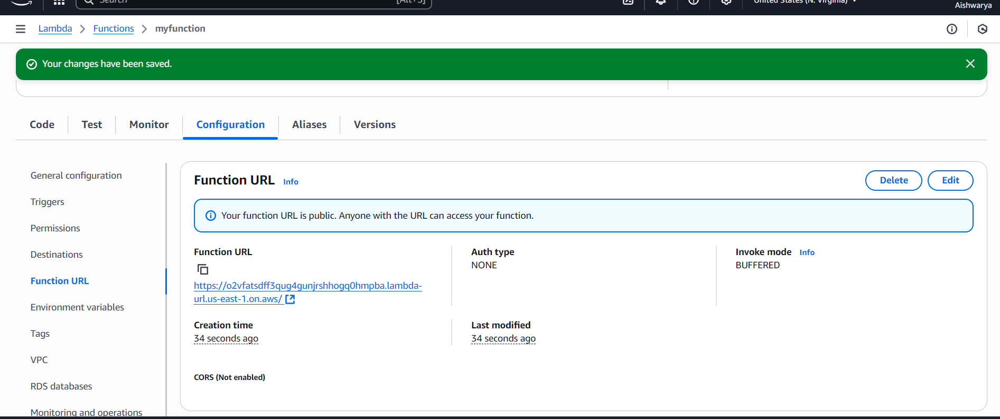

# Serverless-Function
AWS Lambda serverless function deployment.

---

# Task 4: Deploy a Serverless Function to the Cloud

---

## Objective
In this task, I learned to create and deploy a **serverless cloud function (FaaS)** that runs automatically when triggered, without managing servers.  
The task helped me understand **event-driven computing**, **resource optimization**, and how cloud functions work in a **cost-effective way**.

---

## Tools Used
- Cloud Platform: AWS Lambda (Free Tier)  
- Programming Language: Python 3.  
- Testing Tool: Web browser (Function URL)

---

## How It Works
- The function is **serverless** and triggered via an **HTTP Function URL**.  
- It checks for a `name` parameter in the request URL and returns a greeting message.  
- If no name is provided, it defaults to `"Guest"`.  
- Demonstrates **event-driven architecture** and **FaaS (Function-as-a-Service)**.

---

## Testing
1. Open the Function URL in a browser:  
https://<your-function-url>/

**Output:**  
Hello, Guest! Welcome to my cloud function.

yaml

---

## Screenshots
- **Source Code (`lambda_function.py`):**  

- **Code deployed in Lambda:**  
  

- **Function URL configuration:**  
  

- **Function output in browser:**  
  

---

## What I Learned
- Understood **serverless computing** and **FaaS (Function-as-a-Service)**.  
- Learned to deploy a cloud function on **AWS Lambda** without managing servers.  
- Learned to use **HTTP triggers / Function URL** to execute the function on demand.  
- Learned to accept query parameters for **dynamic responses**.  
- Gained hands-on experience with **event-driven architecture**, **cloud function testing**, and **free-tier deployment**.ent-based execution.l knowledge of **cloud automation** and **event-based execution**.
